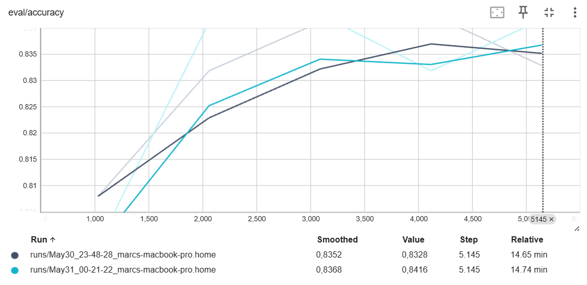
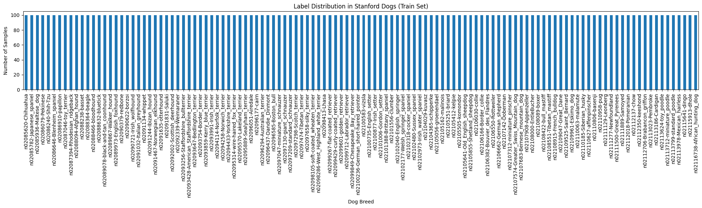

# Dog Breeds Classification

## Project Summary

This project was created as part of the final assignment for the AI Applications course at ZHAW School of Management and Law. The aim is to investigate and compare two modern computer vision methods for dog breed recognition:

A custom-trained and fine-tuned Vision Transformer (ViT) model, specifically trained on images from the Stanford Dogs dataset, which contains over 100 dog breeds.

A zero-shot CLIP model, which performs classification by matching dog images with textual labels, without being explicitly trained on the dataset.

The result is an interactive Gradio web app that allows users to upload images of dogs and view predictions from both models side by side. The full workflow — from dataset handling and model training to evaluation and deployment — is available in the accompanying Jupyter notebooks.

### Name & URL

| Name              | URL                                                                                                     |
| ----------------- | ------------------------------------------------------------------------------------------------------- |
| Huggingface Space | [Huggingface Space](https://huggingface.co/spaces/Flogoro/ZeroShotStanfordDogsGoemaflo)                |
| Model Page        | [ViT Model on Huggingface](https://huggingface.co/Flogoro/vit-base-maurice-fp-stanford-dogs)           |
| Code              | [GitHub Repository](https://github.com/goemansheir/dog-breed-classification)                           |
| Dataset (Google-Drive)           | [Dataset](https://drive.google.com/drive/folders/1ISyR2ykyks__exkhWveNJlouv8bh3JzV?usp=drive_link) |

## Labels
The model was trained and evaluated on the Stanford Dogs dataset, which includes images from the following 120 dog breeds. Each label combines the WordNet synset ID with the corresponding breed name:

```
001. n02085620-Chihuahua  
002. n02085782-Japanese_spaniel  
003. n02085936-Maltese_dog  
004. n02086079-Pekinese  
005. n02086240-Shih-Tzu  
006. n02086646-Blenheim_spaniel  
007. n02086910-papillon  
008. n02087046-toy_terrier  
009. n02087394-Rhodesian_ridgeback  
010. n02088094-Afghan_hound  
011. n02088238-basset  
012. n02088364-beagle  
013. n02088466-bloodhound  
...
116. n02113799-standard_poodle  
117. n02113978-Mexican_hairless  
118. n02115641-dingo
119. n02115913-dhole
120. n02116738-African_hunting_dog
```

*(To ensure readability, only a subset has been listed. The full list can be found at the bottom.)*

## Data Sources and Models

| Data Source                                                                          | Description                                                    |
| ------------------------------------------------------------------------------------ | -------------------------------------------------------------- |
| [maurice-fp/stanford-dogs](https://huggingface.co/datasets/maurice-fp/stanford-dogs) | A fine-grained, labeled image dataset containing 20,580 photos across 120 dog breeds, based on the official Stanford Dogs dataset. |
| [google/vit-base-patch16-224](https://huggingface.co/google/vit-base-patch16-224) | A general-purpose Vision Transformer model used as the base for fine-tuning on the dog dataset. |
| [openai/clip-vit-base-patch32](https://huggingface.co/openai/clip-vit-base-patch32) | A pretrained CLIP model used for zero-shot breed classification via text prompts. |


## Data Augmentation

| Augmentation                                | Description                                                                 |
|---------------------------------------------|-----------------------------------------------------------------------------|
| `RandomResizedCrop(224)`                    | Randomly crops and resizes the image to 224×224 pixels.                     |
| `RandomHorizontalFlip()`                    | Flips the image horizontally with a 50% probability.                        |
| `brightness=0.2, contrast=0.2, saturation=0.2`       | Randomly adjusts brightness, contrast, saturation, and hue with strength 0.3. |


## Model Training

### Data Splitting Method (Train/Validation/Test)

A total of **20,580 images across 120 dog breeds** were used for training, validation, and testing. The dataset was split using the **predefined split provided by Hugging Face**, corresponding to approximately **80% for training**, **10% for validation**, and **10% for testing**.  
This commonly used ratio ensures that the model has **sufficient data to learn**, while also reserving enough samples to **tune hyperparameters** and **evaluate generalization performance**.

| Split      | Number of Samples |
| ---------- | ----------------: |
| Train      |              16464 |
| Validation |              2058 |
| Test       |              2058 |

## Training Metrics
Training was limited to 5 epochs due to computational constraints and runtime performance considerations. As such, the reported metrics reflect early-stage training and may not represent the full potential of the models under longer training regimes.

| Epoch | Training Loss | Validation Loss | Accuracy |
|-------|---------------|-----------------|----------|
| 1     | 1.783900      | 1.649160        | 79.88%   |
| 2     | 0.765000      | 0.765462        | 84.11%   |
| 3     | 0.650400      | 0.655783        | 84.26%   |
| 4     | 0.605400      | 0.660111        | 83.19%   |
| 5     | 0.627900      | 0.613334        | 84.35%   |


### TrensorBoard
More details to the model and it's training can be found at [HuggingFace TensorBoard](https://huggingface.co/Flogoro/vit-base-maurice-fp-stanford-dogs/tensorboard)
| Model/Method                                                                          | TensorBoard Run Directory                                                       |
|---------------------------------------------------------------------------------------|----------------------------------------------------------------------------------------|
| Transfer Learning with `google/vit-base-patch16-224` (without data augmentation)                                                               | `runs/May30_23-48-28_marcs-macbook-pro.home`                                           |
| Transfer Learning with `google/vit-base-patch16-224` (with data augmentation)                                                              | `runs/May31_00-21-22_marcs-macbook-pro.home`                                           |



## Results / Final Evaluation

To evaluate the effectiveness of different image classification strategies, various approaches were compared using a consistent evaluation framework. Specifically, transfer learning with the Vision Transformer (ViT) model—both with and without data augmentation—was assessed alongside zero-shot classification using the CLIP model. The results show that transfer learning consistently outperformed the zero-shot method in terms of accuracy. Data augmentation contributed a modest but measurable improvement. While the CLIP model enables flexible zero-shot classification, its significantly lower accuracy highlights the limitations of this approach without task-specific fine-tuning.

| Model/Method                                                         | Accuracy | Precision | Recall |
|----------------------------------------------------------------------|----------|-----------|--------|
| Transfer Learning with `google/vit-base-patch16-224` (without data augmentation) | 83.28%      | -         | -      |
| Transfer Learning with `google/vit-base-patch16-224` (with data augmentation)  | 84.16%      | -         | -      |
| Zero-shot Image Classification with `openai/clip-vit-large-patch14` | 48.49%     | 48.00%    | 48.49%    |


## Visual References




## Full list of labels:
```
001. n02085620-Chihuahua  
002. n02085782-Japanese_spaniel  
003. n02085936-Maltese_dog  
004. n02086079-Pekinese  
005. n02086240-Shih-Tzu  
006. n02086646-Blenheim_spaniel  
007. n02086910-papillon  
008. n02087046-toy_terrier  
009. n02087394-Rhodesian_ridgeback  
010. n02088094-Afghan_hound  
011. n02088238-basset  
012. n02088364-beagle  
013. n02088466-bloodhound  
014. n02088632-bluetick  
015. n02089078-black-and-tan_coonhound  
016. n02089867-Walker_hound  
017. n02089973-English_foxhound  
018. n02090379-redbone  
019. n02090622-borzoi  
020. n02090721-Irish_wolfhound  
021. n02091032-Italian_greyhound  
022. n02091134-whippet  
023. n02091244-Ibizan_hound  
024. n02091467-Norwegian_elkhound  
025. n02091635-otterhound  
026. n02091831-Saluki  
027. n02092002-Scottish_deerhound  
028. n02092339-Weimaraner  
029. n02093256-Staffordshire_bullterrier  
030. n02093428-American_Staffordshire_terrier  
031. n02093647-Bedlington_terrier  
032. n02093754-Border_terrier  
033. n02093859-Kerry_blue_terrier  
034. n02093991-Irish_terrier  
035. n02094114-Norfolk_terrier  
036. n02094258-Norwich_terrier  
037. n02094433-Yorkshire_terrier  
038. n02095314-wire-haired_fox_terrier  
039. n02095570-Lakeland_terrier  
040. n02095889-Sealyham_terrier  
041. n02096051-Airedale  
042. n02096177-cairn  
043. n02096294-Australian_terrier  
044. n02096437-Dandie_Dinmont  
045. n02096585-Boston_bull  
046. n02097047-miniature_schnauzer  
047. n02097130-giant_schnauzer  
048. n02097209-standard_schnauzer  
049. n02097298-Scotch_terrier  
050. n02097474-Tibetan_terrier  
051. n02097658-silky_terrier  
052. n02098105-soft-coated_wheaten_terrier  
053. n02098286-West_Highland_white_terrier  
054. n02098413-Lhasa  
055. n02099267-flat-coated_retriever  
056. n02099429-curly-coated_retriever  
057. n02099601-golden_retriever  
058. n02099712-Labrador_retriever  
059. n02099849-Chesapeake_Bay_retriever  
060. n02100236-German_short-haired_pointer  
061. n02100583-vizsla  
062. n02100735-English_setter  
063. n02100877-Irish_setter  
064. n02101006-Gordon_setter  
065. n02101388-Brittany_spaniel  
066. n02101556-clumber  
067. n02102040-English_springer  
068. n02102177-Welsh_springer_spaniel  
069. n02102318-cocker_spaniel  
070. n02102480-Sussex_spaniel  
071. n02102973-Irish_water_spaniel  
072. n02104029-kuvasz  
073. n02104365-schipperke  
074. n02105056-groenendael  
075. n02105162-malinois  
076. n02105251-briard  
077. n02105412-kelpie  
078. n02105505-komondor  
079. n02105641-Old_English_sheepdog  
080. n02105855-Shetland_sheepdog  
081. n02106030-collie  
082. n02106166-Border_collie  
083. n02106382-Bouvier_des_Flandres  
084. n02106550-Rottweiler  
085. n02106662-German_shepherd  
086. n02107142-Doberman  
087. n02107312-miniature_pinscher  
088. n02107574-Greater_Swiss_Mountain_dog  
089. n02107683-Bernese_mountain_dog  
090. n02107908-Appenzeller  
091. n02108000-EntleBucher  
092. n02108089-boxer  
093. n02108422-bull_mastiff  
094. n02108551-Tibetan_mastiff  
095. n02108915-French_bulldog  
096. n02109047-Great_Dane  
097. n02109525-Saint_Bernard  
098. n02109961-Eskimo_dog  
099. n02110063-malamute  
100. n02110185-Siberian_husky  
101. n02110627-affenpinscher  
102. n02110806-basenji  
103. n02110958-pug  
104. n02111129-Leonberg  
105. n02111277-Newfoundland  
106. n02111500-Great_Pyrenees  
107. n02111889-Samoyed  
108. n02112018-Pomeranian  
109. n02112137-chow  
110. n02112350-keeshond  
111. n02112706-Brabancon_griffon  
112. n02113023-Pembroke  
113. n02113186-Cardigan  
114. n02113624-toy_poodle  
115. n02113712-miniature_poodle  
116. n02113799-standard_poodle  
117. n02113978-Mexican_hairless  
118. n02115641-dingo
119. n02115913-dhole
120. n02116738-African_hunting_dog
```
